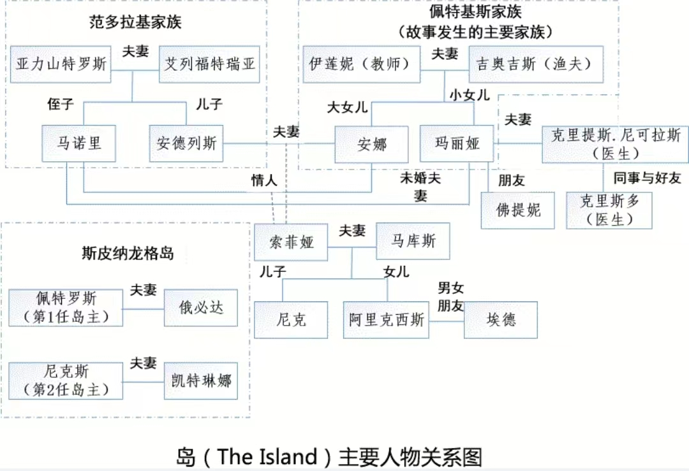

## 作者简介

维多利亚·希斯洛普，1959年出生于英国东南部肯特郡，毕业于牛津大学。《岛》为其长篇处女作，一出版便引起巨大轰动，两个月内即力压《达·芬奇密码》《追风筝的人》《哈利·波特6》，登上英国各大畅销书排行榜首，最后以152万册成为年度销量第1名。

> “当今欧洲唯一可以与J.K.罗琳比肩的优秀作家。”
> —— 欧洲媒体

> “一部能够使人回味一生的凄美作品。”
> —— 美洲媒体

## 作品背景

小说《岛》以位于地中海之中的两个希腊岛屿——克里特和斯皮纳龙格为背景。

在希腊爱琴海的克里特岛海岸以北，布拉卡对面隔海相望的是斯皮纳龙格，斯皮纳龙格岛的风物和一水之隔的布拉卡没什么不同，也有湛蓝的海水和温暖的海风，有成片成片开满野花的山坡，但1903年之后，却因为麻风病这个可怕的存在而成为禁忌的代名词...

## 三个真相

### 顺风顺水的坦途，实际通向深渊

相比于佩特基斯家的其他人，大女儿安娜似乎得到了上帝所有的偏爱。安娜讨厌家务，即使是在母亲患麻风病离家，父亲面对家务一头雾水的情况下，她也拒绝分担。无奈，妹妹承担起了这份责任。父亲和妹妹的顺从，让安娜愈发骄纵任性，即使偶尔被要求去取面包，她也牢骚满天。安娜不愿做的事可以不做，一直向往的贵妇人生活也实现了。在一次舞会上，安娜艳压众人的美貌成功吸引了庄园主的儿子安德烈斯的注意，不久，安娜就嫁给了他。婚后丈夫对安娜的要求无有不应。安娜想改变原有的家居风格，他就去求父母答应；安娜婚后四年不想生孩子，他也不强求。安娜太顺了，顺到她可能以为这世上的事情都会按她的心意发展，也许是习惯了心想事成，安娜的行为越来越无所顾忌。在婚姻生活逐渐平淡后，她出轨了丈夫的堂弟。很长一段时间，丈夫并没有察觉，她本可以选择停下来，回归原来的生活。但安娜没有，幽会带来的颤抖和兴奋让她深陷其中，最后丈夫发现真相，她也死在丈夫的枪下。没有尝过挫折滋味的安娜，不懂得珍惜眼前的幸福。只要她稍微有些顾忌，就能在丈夫宠爱下，在物质的富足中安稳度日。那些想什么就有什么的过往，变成了悲剧的推手。习惯了顺风顺水的人，会逐渐忘记什么是畏忌，只按自己的心意行事。只是，人一旦开始任意妄为，行差踏错就在一念之间。

### 一波三折的崎岖，其实暗藏新生

与姐姐安娜的一帆风顺相比，玛丽娅的生活可谓一波三折。在姐姐的家庭聚会上，玛丽娅认识了马诺里。马诺里一见她就觉得太美了，不久就对她展开追求。玛丽娅也被他的风趣幽默俘获，两人决定结婚。正当玛丽娅沉浸在即将结婚的喜悦中时，一天，她突然发现自己脚上有块奇怪的印记。医生检查过后，确诊玛丽娅患上了麻风病。对玛丽娅来说，一切宛如天塌一般，不仅梦想中婚姻生活成了泡影，还要在人生地不熟的隔离岛度过余生。初到岛上，陌生的人和环境，加上不确定的未来，都让玛丽娅感到绝望。但慢慢地，她开始看到了希望。在这里，她向老岛主夫人倾诉，感受到母亲般的温暖；用带来的物品布置新家，熟悉的味道令她安心；得知父亲可以来岛上的家里坐坐，她更是无比的兴奋！玛丽娅开始用自己掌握的草药知识，帮岛上的人治疗，生活开始变得忙碌又充实。命运没有辜负这个善良的女孩，治疗麻风病的特效药研制成功了。那位把特效药带上岛的医生，被玛丽娅充满希望的眼睛和初生般的纯洁吸引，与玛丽娅一起坠入爱河。上天想要成就一个人，不会让他一路平顺，而是会给予各种阻挠。只有接受磨炼，跨过沟沟坎坎，才能看到胜利的曙光。

### 有喜有忧的生活，才是人间真实

作为佩特斯基家的大家长，吉奥吉斯的一生都在忧喜交织中度过。妻子确诊麻风病被迫隔离，一下子抛下了两个女儿，一摊子家务。一有时间，吉奥吉斯就会去看望妻子。但只过了几年，妻子就死于麻风病。失去妻子的他，最终咽下苦涩，挣扎着继续前行。等到女儿们成年后，生活终于给他带来了好消息。大女儿嫁入了庄园主家。吉奥吉斯觉得欣慰又自豪，女儿终于有了依靠，而且是这样一个有地位的家庭。可是，就是这点甜蜜也被接下来的巨大悲伤冲散了。二女儿突然被确诊为麻风病。也许是上天动了恻隐之心，几年之后，二女儿的麻风病被治愈，她再次回到了父亲身边。吉奥吉斯看着她站在家里，那个过去只存在于照片上的人，现在活生生地站在面前，一股巨大的幸福感充满了他的心间。吉奥吉斯这一辈子，尝尽了生活的滋味。生活是多变的，苦辣酸甜咸，五味杂陈才是它的本色。我们的人生既不会一帆风顺，也不全是蜿蜒崎岖，而是狂风暴雨后的日出，风平浪静下的暗流。生活的真正面目，从来都是有喜有忧，笑泪参半。

## 写作手法：对比

《岛》中，作者将阿丽克西斯家族的四个女人——伊莲妮、安娜、玛丽亚和索菲亚置于麻风病阴影下，让她们经历恐惧、痛苦、无助、无奈乃至死亡威胁，以此考察面临人生变故时如何选择人生，从而激起现代人麻木的神经，唤醒人们跟随自己一起思考、感悟生命。

整个故事情节始终在伊莲妮、玛丽娅母女积极人生观和安娜、索菲亚母女消极人生观之间的对比中展开。伊莲妮和玛丽娅是积极向上的生命的体现，敢于面对生活的艰辛和磨难，富有爱心，并永远保持纯净的自我。伊莲妮勇敢坚毅，从不丧失自我，心中总是装着他人，对亲人、同胞充满爱，尽管最终被麻风病魔夺取了生命，却无碍她美丽人生的传承。玛丽娅是伊莲妮的承继，她的一生中，生活被毁又被重建，爱情被毁又重生希望，尽管悲怆，却让人感受到了苦寒生命之花的灿烂。安娜和索菲亚对人生逆境逃避和消极，安娜的逃避让她陷入物欲中不能自拔，最终被欲望反噬；索菲娅的逃避让她抛弃养父母，深受良心谴责而无法面对女儿。

作品《岛》中，除了上述的对比，还隐含着另外一种比较，斯皮纳龙格岛和克里特岛之间的社会群体生命的比较。斯皮纳龙格岛是被整个社会遗弃，几乎与世隔绝的麻风病隔离区。正是这样的一个孤岛，却造就了一个团结一致、积极向上的社会生态。

## 主题思想：希望和重生

斯皮纳龙格是特别的，它的特别最初是来自麻风病，因为成为麻风病人的隔离区而成了世人眼中悲情而绝望的死地。岛上的居民却不甘就此屈服，他们把斯皮纳龙格当作是救赎之地，虽然身体被疾病折磨得痛苦不堪，却想方设法让自己过得好一些，想方设法把斯皮纳龙格变成一个可以称之为家园的地方。

岛上有教堂为居民提供心灵的庇护，有学校给孩子们受提供教育的机会，有饭馆让朋友小聚，有商店提供日常所需，除了身体上的折磨以外，岛上的生活和岛外没有什么两样。两任岛主皆是经过民主选举产生，他们前仆后继地为岛民争取最大的利益和保护。两位医生多年来坚持为病人寻找治愈疾病的方法，最终取得成功，使被治愈的病人回到了亲人身边，暂时没有康复的病人也被转移到雅典接受更好的治疗。这个小岛从绝望中重生了，使它得以重生的力量来自岛上的人们，来自肯图马里斯和帕帕迪米特里奥两位岛主和他们的下属，来自拉帕基斯和克里提斯医生，来自伊莲妮和玛丽娅母女，来自岛上所有不屈服于残酷命运的普通人，来自他们倍受折磨的身体里迸发出的惊人力量。

斯皮纳龙格这个名字所蕴含的意义不是绝望和禁忌，而是希望和重生，是人们身上散发出的令人赞叹的人性光芒。克里特具有的是秀丽美，它的美令人心情舒畅；而斯皮纳龙格则应具有崇高美，从外部看阴暗而晦涩，但是其间发生的故事，岛民们对抗命运的努力，足以震撼心灵，足以唤起心中的崇高之美。崇高的情感是伊莲妮和玛丽娅等人与病痛的抗争，是吉奥吉斯的坚忍守护，是医生们的悲悯仁爱，而不是安娜和马诺里的追求享乐，自私放纵，也不是索菲亚的逃避现实，背弃亲人。

岛上的人们，不管过去如何的贫贱贵富，相互间充满着友爱。岛上尽管条件恶劣，人们却在这个不祥之地，一起创造了一个民主平等、公平公正、团结友爱的社会。小说的结尾，作者让死亡之岛最终获得重生的希望，被大陆社会所接纳；让索菲亚卸下了沉重包袱，不再因为是麻风病人、通奸犯、谋杀犯的后代感到耻辱，而是“像看电影中的人物那样看待她的长辈。最后看不到耻辱，只看到英雄主义，没有不忠，只有激情，没有麻风病，只有爱”。

## 总结

我们无法用条条框框定义生活，也无法一成不变亦步亦趋。我们能做的，只有接受生活的无常，警惕命运的馈赠，看开世事的为难。生活的万般滋味，只有细细品尝，才会觉得回味无穷。这个世界纷繁无常，愿我们既尝得了甜，也吃得了苦，既看得了风景，也忍得了晦暗。如果生活没有光，那我们就做自己的明灯。
